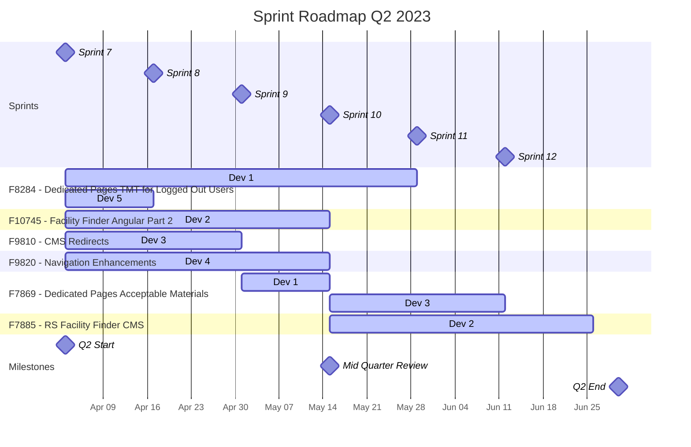

```mermaid
gantt
    title Sprint Roadmap Q2 2023
    dateFormat YYYY-MM-DD
    axisFormat %b %d

    section Sprints
    Sprint 7  :milestone, s7, 2023-04-03, 0d
    Sprint 8  :milestone, s8, 2023-04-17, 0d
    Sprint 9  :milestone, s9, 2023-05-01, 0d
    Sprint 10 :milestone, s10, 2023-05-15, 0d
    Sprint 11 :milestone, s11, 2023-05-29, 0d
    Sprint 12 :milestone, s12, 2023-06-12, 0d

    section F8284 - Dedicated Pages TMT for Logged Out Users
    Dev 1 :active, f8284_d1, 2023-04-03, 56d
    Dev 5 :active, f8284_d5, 2023-04-03, 14d

    section F10745 - Facility Finder Angular Part 2
    Dev 2 :active, f10745_d2, 2023-04-03, 42d

    section F9810 - CMS Redirects
    Dev 3 :active, f9810_d3, 2023-04-03, 28d

    section F9820 - Navigation Enhancements
    Dev 4 :active, f9820_d4, 2023-04-03, 42d

    section F7869 - Dedicated Pages Acceptable Materials
    Dev 1 :active, f7869_d1, 2023-05-01, 14d
    Dev 3 :active, f7869_d3, 2023-05-15, 28d

    section F7885 - RS Facility Finder CMS
    Dev 2 :active, f7885_d2, 2023-05-15, 42d

    section Milestones
    Q2 Start :milestone, m1, 2023-04-03, 0d
    Mid Quarter Review :milestone, m2, 2023-05-15, 0d
    Q2 End :milestone, m3, 2023-06-30, 0d
```
