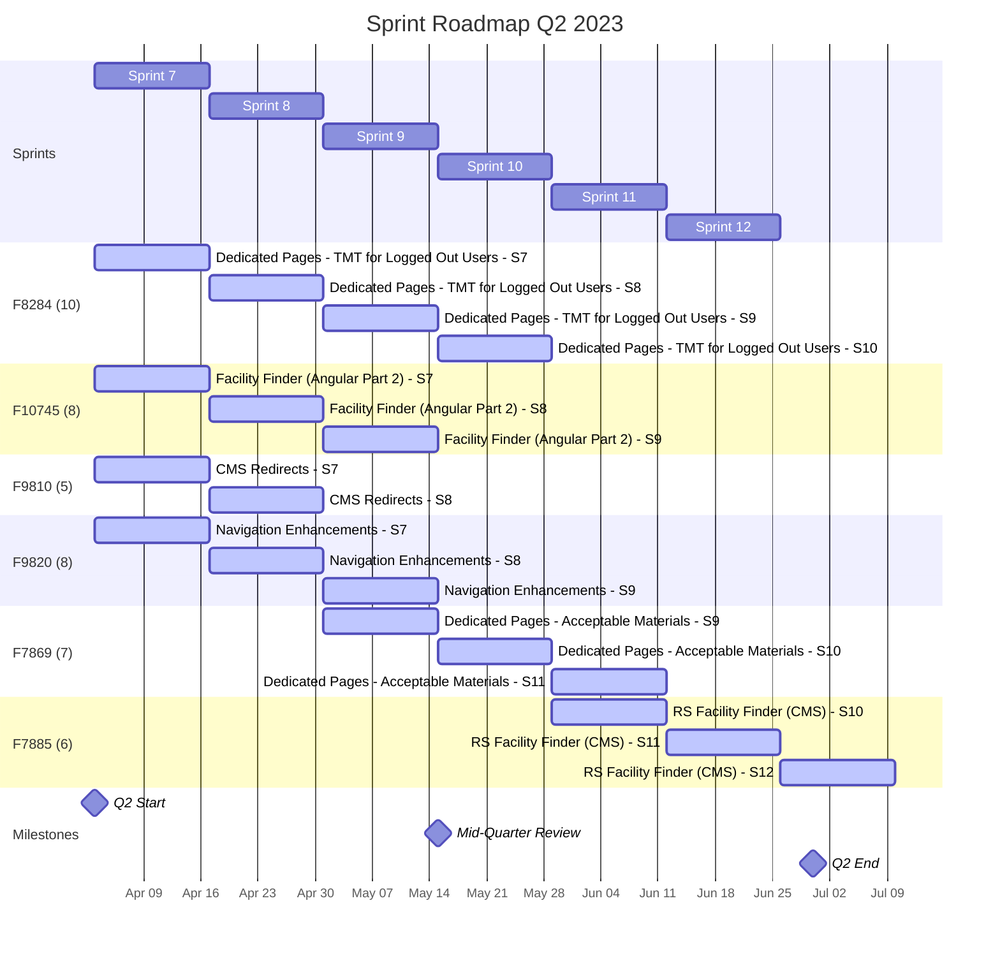

```mermaid
gantt
    title Sprint Roadmap Q2 2023
    dateFormat YYYY-MM-DD
    axisFormat %b %d

    section Sprints
    Sprint 7 :s7, 2023-04-03, 14d
    Sprint 8 :s8, after s7, 14d
    Sprint 9 :s9, after s8, 14d
    Sprint 10 :s10, after s9, 14d
    Sprint 11 :s11, after s10, 14d
    Sprint 12 :s12, after s11, 14d

    section F8284 (10)
    Dedicated Pages - TMT for Logged Out Users - S7 :active, f8284_s7, 2023-04-03, 14d
    Dedicated Pages - TMT for Logged Out Users - S8 :active, f8284_s8, after f8284_s7, 14d
    Dedicated Pages - TMT for Logged Out Users - S9 :active, f8284_s9, after f8284_s8, 14d
    Dedicated Pages - TMT for Logged Out Users - S10 :active, f8284_s10, after f8284_s9, 14d

    section F10745 (8)
    Facility Finder (Angular Part 2) - S7 :active, f10745_s7, 2023-04-03, 14d
    Facility Finder (Angular Part 2) - S8 :active, f10745_s8, after f10745_s7, 14d
    Facility Finder (Angular Part 2) - S9 :active, f10745_s9, after f10745_s8, 14d

    section F9810 (5)
    CMS Redirects - S7 :active, f9810_s7, 2023-04-03, 14d
    CMS Redirects - S8 :active, f9810_s8, after f9810_s7, 14d

    section F9820 (8)
    Navigation Enhancements - S7 :active, f9820_s7, 2023-04-03, 14d
    Navigation Enhancements - S8 :active, f9820_s8, after f9820_s7, 14d
    Navigation Enhancements - S9 :active, f9820_s9, after f9820_s8, 14d

    section F7869 (7)
    Dedicated Pages - Acceptable Materials - S9 :active, f7869_s9, 2023-05-01, 14d
    Dedicated Pages - Acceptable Materials - S10 :active, f7869_s10, after f7869_s9, 14d
    Dedicated Pages - Acceptable Materials - S11 :active, f7869_s11, after f7869_s10, 14d

    section F7885 (6)
    RS Facility Finder (CMS) - S10 :active, f7885_s10, 2023-05-29, 14d
    RS Facility Finder (CMS) - S11 :active, f7885_s11, after f7885_s10, 14d
    RS Facility Finder (CMS) - S12 :active, f7885_s12, after f7885_s11, 14d

    section Milestones
    Q2 Start :milestone, m1, 2023-04-03, 0d
    Mid-Quarter Review :milestone, m2, 2023-05-15, 0d
    Q2 End :milestone, m3, 2023-06-30, 0d
```
